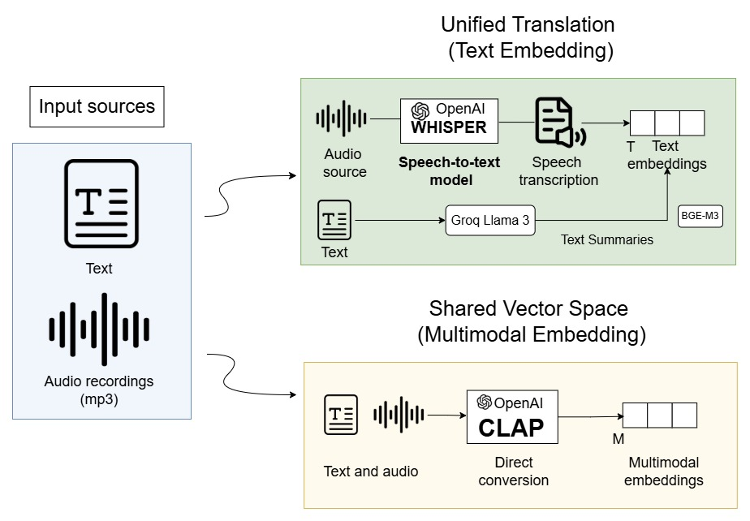

# Audio Pipeline

This folder contains the notebook:

- `rag_pipeline_audios.ipynb`

It builds and evaluates audio RAG systems over spoken content, comparing transcript-first retrieval with audio-text shared-space retrieval.

<center></center>

## What It Does

The pipeline compares two retrieval strategies on the same audio source: a unified translation approach (Whisper transcript embedded as text) and a shared vector space approach (CLAP joint audio-text embeddings). Both strategies share the same generator and reranker, so differences in evaluation reflect retrieval behaviour only.

- **Whisper transcript RAG** (unified translation): the audio is transcribed by Whisper (faster-whisper backend by default), the transcript is split into timestamped chunks of configurable size and overlap, and text embeddings are used for retrieval. Supports dense search, BM25, hybrid retrieval, and cross-encoder reranking.

- **CLAP audio-text RAG** (shared vector space): the raw audio is split into overlapping fixed-length segments and embedded directly with CLAP. Text queries are encoded by CLAP's text encoder in the same shared space. Retrieved audio segments are paired with their Whisper transcript at generation time, since the LLM receives text only. Supports dense CLAP retrieval and optional transcript-based cross-encoder reranking; BM25 is intentionally excluded from the CLAP path.

Concretely the notebook:

- Loads the audio file with `librosa` (48 kHz mono) and transcribes it with Whisper. The transcript is cached on disk, keyed by source-file hash and model name, so re-running the notebook does not re-transcribe.
- Builds two Qdrant collections (`audio_whisper_v1` with BGE-m3 text embeddings, 1024-dim, and `audio_clap_v1` with CLAP audio embeddings, 512-dim).
- Exposes a unified retrieval interface across both approaches with toggleable stages (dense, BM25, hybrid, rerank).
- Generates final answers with either a local Hugging Face model or an Ollama endpoint. The audio content is always represented as text (transcript) at the LLM prompt level.
- Evaluates both approaches with BERTScore, lexical precision/recall, context recall, timestamp coverage, and must/should claim recall over a shared claim-annotated test set.
- Provides an interactive widget that filters cached evaluation results across approaches and retrieval stages without re-running generation or BERTScore.

## Inputs and Outputs

- Put input audio files in `audio_pipeline/content/`. Accepted formats: mp3, wav, m4a, flac.
- Transcripts and intermediate artifacts are cached under `audio_pipeline/cache/` (ignored by git).
- Qdrant collections live in the running Qdrant service, not inside this folder. The defaults are `audio_whisper_v1` (BGE-m3, 1024-dim) and `audio_clap_v1` (CLAP, 512-dim).

> If the audio file is not yet available, you can download one from YouTube
> with `yt-dlp`:
> ```bash
> pip install yt-dlp
> yt-dlp -x --audio-format mp3 -o "content/audio.mp3" <YOUTUBE_URL>
> ```

## Requirements

Install the shared Python dependencies from the repository root:

```bash
python -m pip install --upgrade pip setuptools wheel

python -m pip install --index-url https://download.pytorch.org/whl/cu121 `
  torch==2.5.1+cu121 `
  torchvision==0.20.1+cu121 `
  torchaudio==2.5.1+cu121

python -m pip install -r requirements.txt
```

Main Python packages used by this pipeline:

- `faster-whisper`, `ctranslate2`
- `transformers`, `torch`
- `librosa`, `numpy`
- `sentence-transformers`, `FlagEmbedding`
- `qdrant-client`, `langchain-qdrant`
- `rank-bm25`
- `bert-score`
- `ipywidgets`
- `langchain-ollama`, optional for Ollama generation

External services and system tools:

- Qdrant running locally, usually at `http://localhost:6333`
- ffmpeg, recommended for robust MP3 and audio decoding
- Ollama, optional, if `GENERATION_BACKEND=ollama`

Start Qdrant from the repository root with:

```bash
# Linux / macOS / WSL
docker run -d --name qdrant -p 6333:6333 -p 6334:6334 \
  -v "$(pwd)/qdrant_storage:/qdrant/storage" qdrant/qdrant

# Windows cmd
docker run -d --name qdrant -p 6333:6333 -p 6334:6334 ^
  -v %cd%/qdrant_storage:/qdrant/storage qdrant/qdrant
```

## Configuration

All tunable parameters live in `setup.env` and can be overridden per-run.
The most important variables:

| Variable | Default | Notes |
|---|---|---|
| `AUDIO_PATH` | `./content/audio.mp3` | Source audio file |
| `WHISPER_BACKEND` | `faster-whisper` | Or `hf` for the `transformers.pipeline` fallback |
| `WHISPER_MODEL` | `deepdml/faster-whisper-large-v3-turbo-ct2` | Fast Turbo checkpoint. Alternatives: `Systran/faster-whisper-large-v3`, `Systran/faster-whisper-medium` |
| `WHISPER_LANGUAGE` | `en` | Empty value enables auto-detect |
| `WHISPER_DEVICE` | `cuda` | Or `cpu` / `auto` |
| `WHISPER_COMPUTE_TYPE` | `float16` | Use `int8_float16` for low-VRAM GPUs |
| `WHISPER_BATCH_SIZE` | `16` | Tune to GPU memory |
| `WHISPER_BEAM_SIZE` | `1` | Higher values trade speed for accuracy |
| `WHISPER_VAD_FILTER` | `true` | Whisper voice-activity-detection pre-filter |
| `AUDIO_CHUNK_SECS` | `45` | Whisper transcript chunk size |
| `AUDIO_CHUNK_OVERLAP_SECS` | `5` | Whisper chunk overlap |
| `CLAP_SEGMENT_SECS` | `10` | CLAP audio segment length |
| `CLAP_MODEL` | `laion/larger_clap_general` | Alternatives: `laion/larger_clap_music`, `laion/clap-htsat-unfused` |
| `EMBEDDING_MODEL` | `BAAI/bge-m3` | 1024-dim text encoder |
| `RETRIEVER_K` | `8` | Dense candidates per query |
| `RERANKER_TOP_N` | `4` | Reranker survivors |
| `RERANKER_MODEL` | `cross-encoder/ms-marco-MiniLM-L-6-v2` | Cross-encoder |
| `ENABLE_BM25` | `true` | Sparse retrieval toggle (Whisper path only) |
| `ENABLE_RERANKING` | `true` | Reranker toggle |
| `GENERATION_BACKEND` | `hf` | Or `ollama` |
| `GENERATION_MODEL` | `Qwen/Qwen2.5-3B-Instruct` | Local text-only LLM. For Ollama use e.g. `mistral-nemo:latest` |
| `QDRANT_URL` | `http://localhost:6333` | Local Qdrant |
| `QDRANT_WHISPER_COLLECTION` | `audio_whisper_v1` | Transcript embedding collection |
| `QDRANT_CLAP_COLLECTION` | `audio_clap_v1` | CLAP shared-space collection |
| `RESET_WHISPER_COLLECTION` | `false` | Drops and rebuilds the Whisper collection if `true` |
| `RESET_CLAP_COLLECTION` | `false` | Drops and rebuilds the CLAP collection if `true` |
| `PERSIST_DIR` | `./cache/audio/` | On-disk cache for transcripts and intermediate artifacts |

## Notes

- A CUDA GPU is strongly recommended for faster-whisper, CLAP, BGE-m3, and the cross-encoder. CPU execution is possible for short clips but full notebook runs become impractical on long lectures.
- The Whisper transcript is the only modality information the LLM ever sees: even in the CLAP path, the retrieved audio segment is attached to the LLM prompt via its corresponding Whisper transcript. CLAP affects retrieval, not generation.
- BM25 is excluded from the CLAP retrieval path on purpose: combining BM25 scores on the Whisper transcript with CLAP cosine similarities on the audio signal would mix two unrelated abstraction levels.
- Collection vector dimensions are fixed at creation time. To swap embedding models, set the corresponding `RESET_*_COLLECTION=true` flag for one run, then unset it.
- If Ollama runs on Windows and the notebook runs in WSL, expose Ollama on Windows with `OLLAMA_HOST=0.0.0.0:11434` and set the notebook client URL to the Windows host IP, e.g. `OLLAMA_BASE_URL=http://<windows-host-ip>:11434`. Keep `OLLAMA_HOST` (server bind address) and `OLLAMA_BASE_URL` (client URL) conceptually separate.
