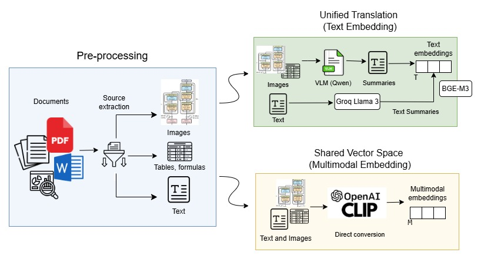
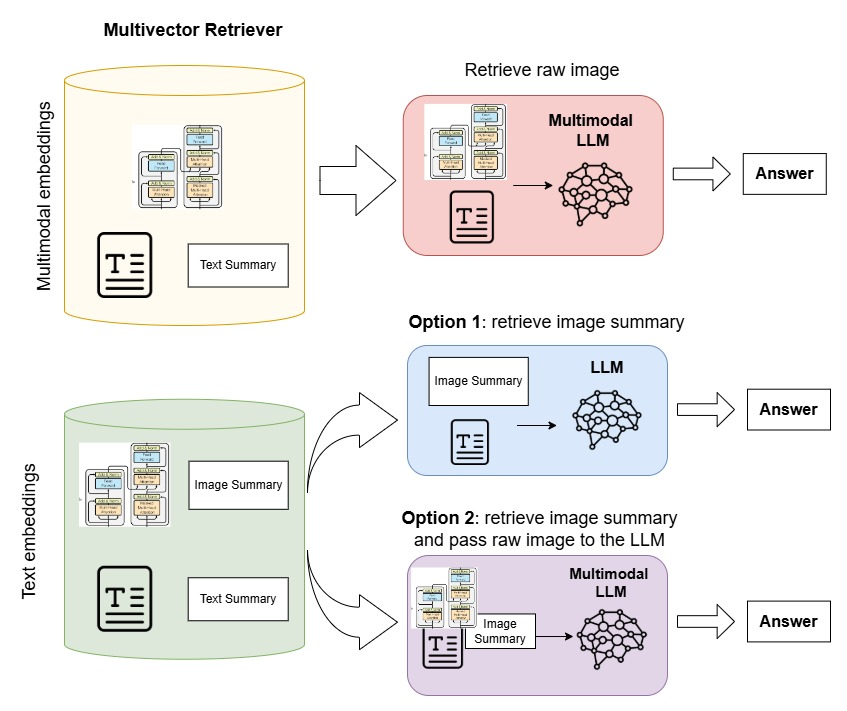

# Image Pipeline

This folder contains the notebook:

- `rag_pipeline_imgs.ipynb`

It builds and evaluates a multimodal RAG pipeline for PDF documents that contain text, tables, charts, diagrams, and other visual elements.



## What It Does

The pipeline compares two retrieval strategies on the same PDF source: a unified translation approach (VLM summaries embedded as text) and a shared vector space approach (CLIP joint text-image embeddings). The unified translation path is further split into two prompting variants at generation time, yielding three configurations evaluated side-by-side:

- **VLM + source linking**: retrieval on summary embeddings, original raw images passed to a multimodal LLM at generation time.
- **VLM summary only**: retrieval on summary embeddings, only summaries (no raw images) passed to the LLM. Compatible with any text-only generator.
- **CLIP shared space**: text and images embedded directly into a joint vector space via OpenCLIP, with no intermediate summarization.



Concretely the notebook:

- Extracts text chunks, images, and table images from PDFs with `unstructured` (`hi_res` strategy + `by_title` or `basic` chunking).
- Summarizes text with a local causal LM (default Qwen2.5-1.5B-Instruct) and images/tables with a local VLM (default Qwen2.5-VL-3B-Instruct).
- Caches all generated summaries on disk, keyed by source file hash, content hash, and model name, so re-running the notebook does not re-summarize.
- Embeds summaries with a local text embedding model (default BGE-m3) and indexes them in a dedicated Qdrant collection.
- Builds a second Qdrant collection for the CLIP shared-space variant.
- Supports dense retrieval, BM25, hybrid retrieval, and cross-encoder reranking; each stage is independently toggleable.
- Generates final answers with either a local Hugging Face model or an Ollama endpoint.
- Evaluates all three approaches with BERTScore, lexical precision/recall, context recall, visual claim recall, and must/should claim recall over a shared claim-annotated test set.
- Exposes an interactive widget that filters cached evaluation results across approaches and retrieval stages without re-running generation.

## Inputs and Outputs

- Put input PDFs in `image_pipeline/content/`.
- Summary caches and intermediate artifacts are written under `image_pipeline/cache/` (ignored by git).
- Qdrant collections live in the running Qdrant service, not inside this folder. The defaults are `multirag_local_hf` (VLM summaries, 1024-dim) and `multirag_local_hf_clip` (CLIP, 512-dim).

## Requirements

Install the shared Python dependencies from the repository root:

```bash
python -m pip install --upgrade pip setuptools wheel

python -m pip install --index-url https://download.pytorch.org/whl/cu121 `
  torch==2.5.1+cu121 `
  torchvision==0.20.1+cu121 `
  torchaudio==2.5.1+cu121

python -m pip install -r requirements.txt
```

Main Python packages used by this pipeline:

- `unstructured`, `unstructured-inference`, `pdfminer.six`, `pdf2image`, `pypdf`
- `transformers`, `qwen-vl-utils`, `torch`
- `sentence-transformers`, `FlagEmbedding`, `open-clip-torch`
- `langchain`, `langchain-qdrant`, `langchain-ollama`
- `qdrant-client`, `rank-bm25`
- `bert-score`, `ipywidgets`

External services and system tools:

- Qdrant running locally, usually at `http://localhost:6333`
- Poppler, required for PDF rendering and extraction
- Tesseract OCR, required by `unstructured` for OCR-heavy PDFs
- Ollama, optional, if `GENERATION_MODEL` is an Ollama model such as `mistral-nemo:latest`

Start Qdrant from the repository root with:

```bash
# Linux / macOS / WSL
docker run -d --name qdrant -p 6333:6333 -p 6334:6334 \
  -v "$(pwd)/qdrant_storage:/qdrant/storage" qdrant/qdrant

# Windows cmd
docker run -d --name qdrant -p 6333:6333 -p 6334:6334 ^
  -v %cd%/qdrant_storage:/qdrant/storage qdrant/qdrant
```

## Configuration

All tuneable parameters live in `setup.env` and can be overridden per-run.
The most important variables:

| Variable | Default | Notes |
|---|---|---|
| `FILE_PATH` | `./content/attention.pdf` | Source PDF |
| `CHUNKING_STRATEGY` | `by_title` | Or `basic` |
| `MAX_CHARACTERS` | `3000` | Per-chunk character cap |
| `TABLES_AS_IMAGES` | `true` | Route tables through the VLM instead of flattening to text |
| `TEXT_SUMMARY_MODEL` | `Qwen/Qwen2.5-1.5B-Instruct` | Local text summarizer |
| `IMAGE_SUMMARY_MODEL` | `Qwen/Qwen2.5-VL-3B-Instruct` | Local VLM. Valid Qwen2.5-VL sizes: 3B, 7B, 32B, 72B (no 2B) |
| `MAX_IMAGE_SUMMARIZATION_LIMIT` | `999` | Cap on images summarized per indexing run |
| `GENERATION_MODEL` | `Qwen/Qwen2.5-VL-3B-Instruct` | Use a VLM for source linking; any text-only LLM works for VLM-summary-only |
| `EMBEDDING_MODEL` | `BAAI/bge-m3` | 1024-dim text encoder |
| `RETRIEVER_K` | `10` | Dense candidates per query |
| `RERANKER_TOP_N` | `5` | Reranker survivors |
| `RERANKER_MODEL` | `cross-encoder/ms-marco-MiniLM-L-6-v2` | Cross-encoder |
| `ENABLE_BM25` | `true` | Sparse retrieval toggle |
| `ENABLE_RERANKING` | `true` | Reranker toggle |
| `QDRANT_URL` | `http://localhost:6333` | Local Qdrant |
| `QDRANT_COLLECTION` | `multirag_local_hf` | VLM summary collection (CLIP collection appends `_clip`) |
| `RESET_QDRANT_COLLECTION` | `false` | Drops and rebuilds the collection if `true` |
| `OLLAMA_BASE_URL` | empty | URL the notebook connects to (distinct from `OLLAMA_HOST`) |

## Notes

- A CUDA GPU is strongly recommended for Qwen2.5-VL, CLIP, BGE-m3, and the cross-encoder. Without a GPU, the pipeline runs but image summarization becomes the bottleneck.
- The collection's vector dimension is fixed at creation time. To swap embedding models, set `RESET_QDRANT_COLLECTION=true` for one run, then unset it. The same applies to the CLIP collection (`RESET_QDRANT_CLIP_COLLECTION`).
- If Ollama is used on Windows, set `OLLAMA_BASE_URL=http://127.0.0.1:11434` in `setup.env`. Keep `OLLAMA_HOST` (server bind address) and `OLLAMA_BASE_URL` (client URL) conceptually separate.
- Summary cache files are keyed by source-file hash, content hash, and model name, so changing any one of these triggers re-summarization automatically.
