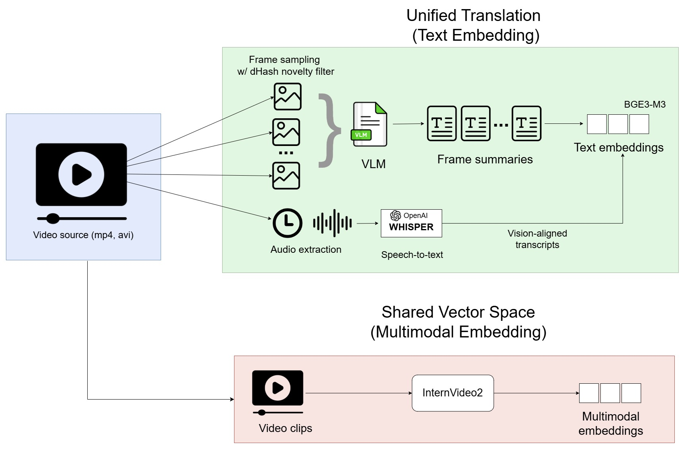

# Video Pipeline

This folder contains the notebook:

- `rag_pipeline_videos.ipynb`

It builds and evaluates video RAG systems that combine visual frames, speech
transcripts, timestamped video segments, and multimodal retrieval.

<center></center>

## What It Does

The pipeline compares two retrieval strategies on the same MP4 source: a shared vector space approach (InternVideo2 joint video-text embeddings) and a unified translation approach (frames described by a VLM, audio transcribed by Whisper Turbo, both fused into text and embedded with BGE-m3). Both strategies share the same generator and reranker.

- **InternVideo2 shared video-text space**: the video is segmented into fixed-length overlapping clips (default 8 s, 2 s overlap, 8 frames per clip), each clip is encoded with InternVideo2, and text queries are encoded in the same shared space. The Whisper transcript is attached to each retrieved clip and passed to the LLM at generation time. Supports dense retrieval and optional cross-encoder reranking on the attached transcript.

- **Unified VLM + Whisper Turbo + BGE pipeline**: representative frames are sampled with a strategic novelty filter (one candidate every 30 s, kept only if its dHash differs from all previously retained frames by at least 8 bits out of 64), each kept frame is summarized by Qwen2.5-VL, the audio track is transcribed by Whisper Turbo, and frame summaries are aligned with transcript windows whose boundaries match retained-frame timestamps. The fused `VISION + TRANSCRIPT` text is embedded with BGE-m3 and indexed in a dedicated Qdrant collection. Supports dense retrieval, BM25, hybrid retrieval, and cross-encoder reranking.

Concretely the notebook:

- Extracts the audio track with `ffmpeg` and caches it on disk, keyed by source-file hash.
- Caches Whisper transcripts and VLM frame summaries per source-file hash and model name, so re-running the notebook does not re-transcribe or
  re-summarize.
- Builds two Qdrant collections (`iv2_only_v1` with InternVideo2 embeddings, 512-dim, and `video_unified_v1` with BGE-m3 embeddings on fused text, 1024-dim).
- Generates final answers with either a local Hugging Face model or an Ollama endpoint. The LLM always receives text (Whisper transcript for the InternVideo2 path, or fused vision+transcript for the unified path).
- Evaluates both approaches with BERTScore, lexical precision/recall, context recall, evidence coverage, and must/should claim recall over a shared claim-annotated test set.
- Provides an interactive widget that filters cached evaluation results across approaches and retrieval stages without re-running generation or BERTScore.

Evidence coverage replaces plain timestamp coverage because a video segment can overlap the right time window while still missing the relevant visual or spoken evidence. The metric is source-aware: claims tagged `visual` are checked against the visual channel, claims tagged `text` against the speech channel, and `both` against either.

## Platform Requirement

Run the full video notebook on Linux or WSL.

Native Windows is not supported for the complete InternVideo2 pipeline. InternVideo2 and related video dependencies (`decord`, custom remote code) are currently unreliable or broken on native Windows in this setup. If you are on Windows, use WSL with a Linux Python environment for this notebook. The other pipelines can run on native Windows, but the video pipeline should be treated as Linux/WSL-only.

## Inputs and Outputs

- Put input video files in `video_pipeline/content/`. Accepted formats: mp4, mov, mkv, avi.
- Extracted audio, transcripts, VLM summaries, and intermediate artifacts are cached under `video_pipeline/cache/` (ignored by git).
- Qdrant collections live in the running Qdrant service, not inside this folder. The defaults are `iv2_only_v1` (InternVideo2, 512-dim) and `video_unified_v1` (BGE-m3 on fused text, 1024-dim).

> If the video file is not yet available, you can download one from YouTube
> with `yt-dlp`:
> ```bash
> pip install yt-dlp
> yt-dlp -o "content/video.mp4" <YOUTUBE_URL>
> ```

## Requirements

Install the shared Python dependencies from the repository root inside the
Linux or WSL environment:

```bash
python -m pip install --upgrade pip setuptools wheel

python -m pip install --index-url https://download.pytorch.org/whl/cu121 `
  torch==2.5.1+cu121 `
  torchvision==0.20.1+cu121 `
  torchaudio==2.5.1+cu121

python -m pip install -r requirements.txt
```

Main Python packages used by this pipeline:

- `transformers`, `torch`, `timm`, `einops`, `safetensors`
- `decord`, `qwen-vl-utils`
- `faster-whisper`, `ctranslate2`
- `sentence-transformers`, `FlagEmbedding`
- `qdrant-client`, `langchain-qdrant`
- `rank-bm25`
- `bert-score`
- `ipywidgets`
- `langchain-ollama`, optional for Ollama generation

External services and system tools:

- Linux or WSL
- ffmpeg, required to extract the audio track from video
- Qdrant running locally, usually at `http://localhost:6333`
- Ollama, optional, if `GENERATION_BACKEND=ollama`

Install ffmpeg on Ubuntu/WSL with:

```bash
sudo apt update
sudo apt install -y ffmpeg
```

Start Qdrant from the repository root with:

```bash
docker run -d --name qdrant -p 6333:6333 -p 6334:6334 \
  -v "$(pwd)/qdrant_storage:/qdrant/storage" qdrant/qdrant
```

## Configuration

All tuneable parameters live in `setup.env` and can be overridden per-run.
The most important variables:

### Source and InternVideo2 path

| Variable | Default | Notes |
|---|---|---|
| `VIDEO_PATH` | `./content/video.mp4` | Source video file |
| `IV2_MODEL` | `OpenGVLab/InternVideo2_CLIP_S` | CLIP-style checkpoint, 512-dim. Alternatives: `OpenGVLab/InternVideo2-Stage2_1B-224p-f8` (1B, 1024-dim), `OpenGVLab/InternVideo2-Stage2_6B-224p-f4` (6B, ~12 GB VRAM) |
| `IV2_NUM_FRAMES` | `8` | Frames sampled per clip (must match the checkpoint suffix `-f4` / `-f8`) |
| `IV2_SEGMENT_SECS` | `8` | Length of each video clip in seconds |
| `IV2_OVERLAP_SECS` | `2` | Overlap between consecutive clips |
| `IV2_BATCH_SIZE` | `4` | Clips per forward pass |

### Unified Translation path

| Variable | Default | Notes |
|---|---|---|
| `UNIFIED_SAMPLE_EVERY_SECS` | `30` | Frame sampling stride before the novelty filter |
| `UNIFIED_DHASH_SIZE` | `8` | dHash grid size (produces an 8×8 = 64-bit fingerprint) |
| `UNIFIED_NOVELTY_HAMMING` | `8` | Minimum Hamming distance (in bits) for a frame to be considered novel |
| `VLM_MODEL` | `Qwen/Qwen2.5-VL-3B-Instruct` | VLM used for frame summarisation |
| `WHISPER_TURBO_MODEL` | `deepdml/faster-whisper-large-v3-turbo-ct2` | Whisper Turbo checkpoint (faster-whisper backend) |
| `WHISPER_TURBO_COMPUTE_TYPE` | `float16` | Use `int8_float16` for low-VRAM GPUs |
| `WHISPER_TURBO_BATCH_SIZE` | `16` | Tune to GPU memory |
| `WHISPER_TURBO_BEAM_SIZE` | `1` | Higher values trade speed for accuracy |
| `WHISPER_TURBO_VAD` | `true` | Voice-activity-detection pre-filter |
| `BGE_MODEL` | `BAAI/bge-m3` | Text encoder for the fused vision+transcript text (1024-dim) |
| `QDRANT_UNIFIED` | `video_unified_v1` | Qdrant collection for the unified path |
| `RESET_UNIFIED` | `false` | Drops and rebuilds the unified collection if `true` |

### Whisper for InternVideo2 LLM context

| Variable | Default | Notes |
|---|---|---|
| `WHISPER_MODEL` | `openai/whisper-large-v3` | Used to produce the transcript attached to retrieved IV2 clips |
| `WHISPER_LANGUAGE` | `en` | Empty value enables auto-detect |

### Retrieval and generation

| Variable | Default | Notes |
|---|---|---|
| `RETRIEVER_K` | `8` | Dense candidates per query |
| `RERANKER_TOP_N` | `4` | Reranker survivors |
| `RERANKER_MODEL` | `cross-encoder/ms-marco-MiniLM-L-6-v2` | Cross-encoder |
| `ENABLE_RERANKING` | `true` | Reranker toggle |
| `GENERATION_BACKEND` | `hf` | Or `ollama` |
| `GENERATION_MODEL` | `Qwen/Qwen2.5-3B-Instruct` | Local text-only LLM. For Ollama use e.g. `mistral-nemo:latest` |
| `QDRANT_URL` | `http://localhost:6333` | Local Qdrant |
| `QDRANT_IV2_ONLY` | `iv2_only_v1` | Qdrant collection for the InternVideo2 path |
| `PERSIST_DIR` | `./cache/iv2_only/` | On-disk cache for transcripts, summaries, and audio extracts |

## Notes

- A CUDA GPU is strongly recommended. InternVideo2, Qwen2.5-VL, Whisper Turbo, BGE-m3, and the cross-encoder are all expensive on CPU; full notebook runs
  become impractical without a GPU.
- The two strategies serve complementary roles. InternVideo2 retrieves directly on the visual signal (well suited to scene-driven queries such as "show me the diagram with the residual connection"); the unified path benefits from BGE's strong retrieval baseline on technical vocabulary and from explicit per-frame textual descriptions.
- The Whisper Turbo checkpoint used by the unified path is independent of the Hugging Face Whisper model used to produce LLM-context transcripts for the InternVideo2 path. They can coexist; one runs at indexing time (Turbo, on the audio track for the unified pipeline), the other runs once at preprocessing time and caches its output for both paths' LLM prompts.
- Collection vector dimensions are fixed at creation time. To swap embedding models, set `RESET_UNIFIED=true` (or the equivalent reset flag for the InternVideo2 collection) for one run, then unset it.
- If Qdrant runs on Windows and the notebook runs in WSL, use the Windows host IP in `QDRANT_URL` instead of `localhost`.
- If Ollama runs on Windows and the notebook runs in WSL, expose Ollama on Windows with `OLLAMA_HOST=0.0.0.0:11434` and set the notebook client URL to the Windows host IP, e.g. `OLLAMA_BASE_URL=http://<windows-host-ip>:11434`. Keep `OLLAMA_HOST` (server bind address) and `OLLAMA_BASE_URL` (client URL) conceptually separate.
- Do not run the InternVideo2 cells in a native Windows Python environment.
